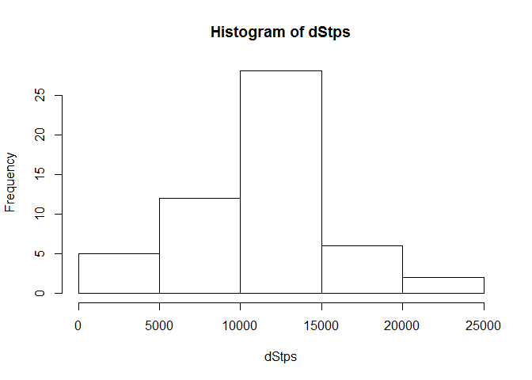

# Reproducible Research: Peer Assessment 1


## Loading and preprocessing the data
<!-- Assuming activity.csv file is in the workspace -->

```r
df <- read.csv("activity.csv", header = TRUE, as.is = TRUE)
```
<!-- Convert the character variable to a date variable -->

```r
df[,2] <- as.Date(df[,2])
```
## What is mean total number of steps taken per day?
To calculate total number of steps taken per day, we can apply sapply function on the data frame to calculate total number of steps taken per day. After that a mean function can be applied to the resulting vector. A histogram shows the distribution of steps taken per day.

```r
dStps <- sapply(split(df, df$date), function(x) sum(x$steps))
hist(dStps)
```



```r
mean(dStps, na.rm = TRUE)
```

```
## [1] 10766.19
```

```r
median(dStps, na.rm = TRUE)
```

```
## [1] 10765
```
The above analysis shows that the average number of steps taken is 10766.19, and the median step is 10765.
## What is the average daily activity pattern?
Split the data frame by interval, and calculate mean steps taken across days. Then plot the results using plot function to see average across intervals.

```r
IStps <- sapply(split(df, df$interval), function(x) mean(x$steps, na.rm = TRUE))
plot(names(IStps), IStps, type="l", xlab="Interval", ylab = "Average Steps", main = "Average steps taken during the day")
```


```r
which.max(IStps)
```

```
## 835 
## 104
```
As you can see, maximum steps are taken during the interval 835 or 6:35 AM.
## Imputing missing values
There are total 2304 observations where data is missing. We are imputing the values based upon average steps taken in that interval across days.

```r
dfMisng <- df[rowSums(is.na(df)) > 0,]
nrow(dfMisng)
```

```
## [1] 2304
```

```r
for(i in 1:dim(dfNew)[1])  # for each row
{
	if (is.na(dfNew[i,1])){
		dfNew[i,1] <- IStps[grep(paste("^", df[i,3], "$", sep=""), names(IStps), value = TRUE)]
	}
}

dStpsNew <- sapply(split(dfNew, dfNew$date), function(x) sum(x$steps))
hist(dStpsNew)
```


```r
mean(dStpsNew, na.rm=TRUE)
```

```
## [1] 10766.19
```

```r
median(dStpsNew, na.rm=TRUE)
```

```
## [1] 10766.19
```
The new mean is the same as we imputed the mean steps taken per interval. Hence, it didn't change the mean. However, median is different than 10765. The new median is 10766.19. Since, we impute average value in place of NA, the total number of steps per day is increased, however it didn't change the average.
## Are there differences in activity patterns between weekdays and weekends?
First we will create a new variable to mark an observation as weekday or weekend.

```r
weekdays1 <- c('Monday', 'Tuesday', 'Wednesday', 'Thursday', 'Friday')
dfNew$wDay <- factor((weekdays(dfNew$date) %in% weekdays1), levels=c(FALSE, TRUE), labels=c('weekend', 'weekday') )
```
Then we can split the data and create new plots.

```r
df1 <- split(dfNew, dfNew$wDay)
wkEnd <- df1[[1]]
wkday <- df1[[2]]

wkDayIStps <- sapply(split(wkday, wkday$interval), function(x) mean(x$steps))
wkEndIStps <- sapply(split(wkEnd, wkEnd$interval), function(x) mean(x$steps))

par(mfrow=c(2,1))
plot(names(wkDayIStps), wkDayIStps, type="l", xlab="Interval", ylab = "Average Steps", main = "Week Day - Average")
plot(names(wkEndIStps), wkEndIStps, type="l", xlab="Interval", ylab = "Average Steps", main = "Week End - Average")
```


